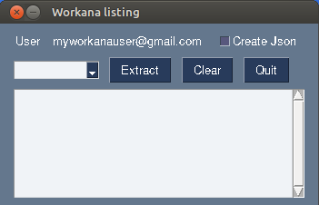

# Get list of projects from Workana 

I made this program to have a list of projects from Workana in one file

 
 
  instead of next, next ...
  


----

# Usage
1. Extract zip file to some folder, for example
```
cd /home/mysuer
unzip workana-listing-v1.0.0.zip
cd workana-listing
```
2. Download chromedriver from https://chromedriver.chromium.org/downloads, copy to folder *workana-listing*.
3. Configure file [config.json](config.json)
   - **username**: Your workana user 
   - **password**: Your workana password
   - **wait**: Implict wait (seconds) for selenium (https://www.selenium.dev/documentation/webdriver/waits/#implicit-wait)
   - **executable_path**: Absolute path to chromedriver, e.g.: /home/mysuer/workana-listing/chromedriver
   - **user-data-dir**: Absolute path to tmp folder for chromedriver, e.g.: /home/mysuer/workana-listing/tmp, see https://chromium.googlesource.com/chromium/src/+/master/docs/user_data_dir.md
   - **searches**: Add {search_name : search_url}. Go to Workana site > Find projects > configure filters (Project category, skills, Publication date, etc), then copy browser url
   - **options**: Chrome options, see https://chromedriver.chromium.org/capabilities

4. Run application
    - GUI
   ```
   cd /home/mysuer/workana-listing
   workana_listing -c /home/mysuer/workana-listing/config.json
    ```
   

    - Command line
   
   Allows to run the application without GUI (scripting)
   ```
   cd /home/mysuer/workana-listing
   workana_listing -c /home/mysuer/workana-listing/config.json -S -s my_search1
    ```
   

   - Help
   ```
   cd /home/mysuer/workana-listing
   workana_listing --help
   usage: workana_listing [-h] -c CONFIG_JSON [-S] [-s SEARCHES [SEARCHES ...]] [-l LOG] [-L {I,D,W,E}] [-v]
   
   List Workana projects
   
   optional arguments:
     -h, --help            show this help message and exit
     -c CONFIG_JSON, --config CONFIG_JSON
                           Application configuration file
     -S, --silent          Run whitout GUI, you must define search name (option --search)
     -s SEARCHES [SEARCHES ...], --search SEARCHES [SEARCHES ...]
                           List of search defined in config.json, 'all' to use all
                           Example: my_search1 my_search2
     -l LOG, --log LOG     Logging configuration file
     -L {I,D,W,E}, --log_level {I,D,W,E}
                           Log level. Valid options: I(info), D(debug), W(warning), E(error)
     -v, --version         Show script version

    ```

# Usage notes

Sometimes some sites reached by Workana are too slow and page keep waiting (workana.reporting.com, worknana.zendesk.com, track.customer.io, etc), I solved stopping the app and executing again :-)

# Sample html 


See [workana_search_1.html](workana_search_1.html)

# Note:
The program use the flags images from this repo: https://github.com/lipis/flag-icons  